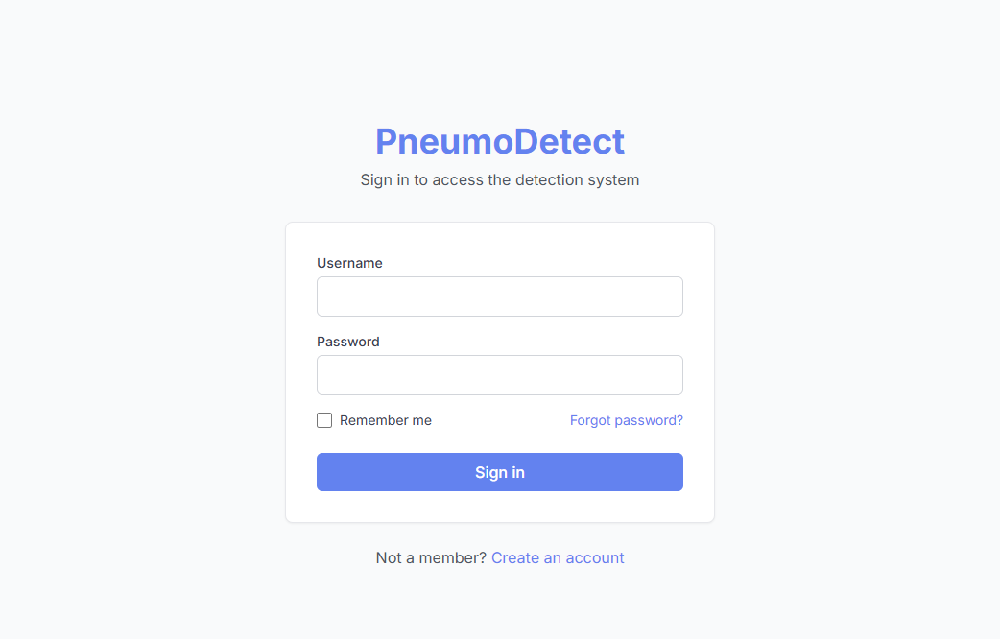
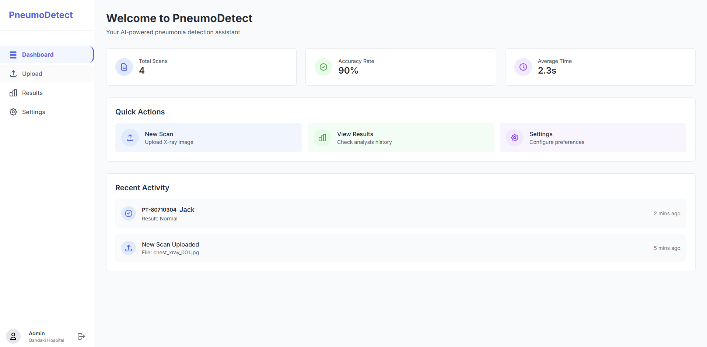
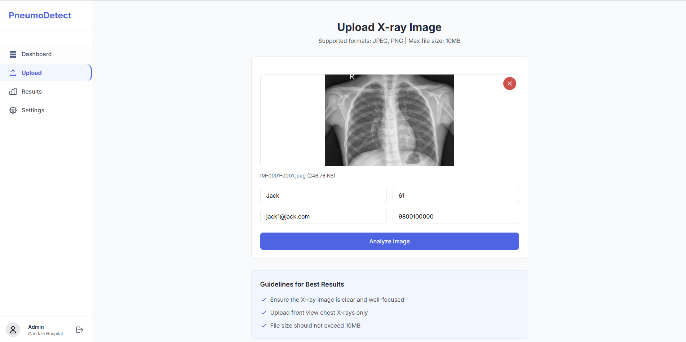
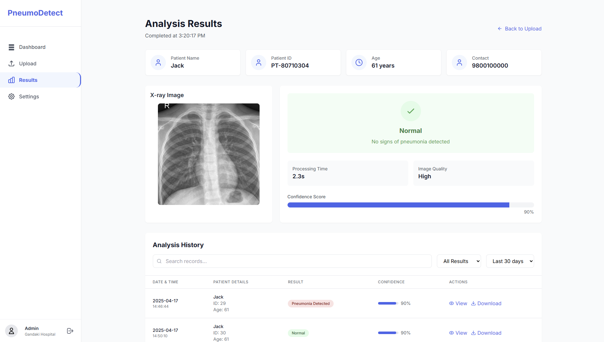

# Pneumonia Detection

This project is designed to detect pneumonia from medical images using machine learning techniques.

## Features

- Automated detection of pneumonia from chest X-ray images.
- Utilizes deep learning models for high accuracy.
- Easy-to-use interface for uploading and analyzing images.

## Installation

1. Clone the repository:
  ```bash
  git clone https://github.com/sushilladhicarree/pneumonodetect.git
  ```
2. Navigate to the project directory:
  ```bash
  cd pneumonodetect
  ```
3. Install the required dependencies:
  ```bash
  npm i
  npm i react-router-dom 
  npm i axios  
  ```
  
   ```bash
  docker run --publish 8000:8000 bikalpakc/pds-python-django-backend-updated:v2
  ```

## Dataset

The project uses publicly available datasets such as the [Chest X-Ray Images (Pneumonia)](https://www.kaggle.com/paultimothymooney/chest-xray-pneumonia).

## Contributing

Contributions are welcome! Please fork the repository and submit a pull request.

## License

This project is licensed under the MIT License. See the [LICENSE](LICENSE) file for details.

## Acknowledgments

- Inspired by various pneumonia detection research papers.
- Thanks to [Bikalpa KC](https://github.com/bikalpakc) and [Sadikshya Poudel](https://github.com/sadikshya0) for their huge contributions in making this project possible.

## Screenshots
<p align="center">
  
  
  
  
</p>